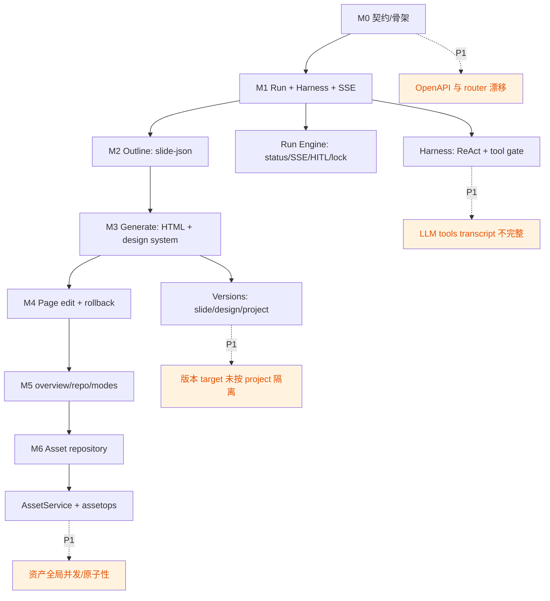

# 后端 M0-M6 全局代码审查报告

审查对象：`backend/` 全部后端实现、`docs/` 中 M0-M6 相关需求/架构/API/数据模型文档。  
审查基线：`main` 分支 `ae907b0 feat(M6): 修复资产生命周期一致性与回滚入口`。  
受众：后端开发团队。

## 结论

M0-M6 的总体演进方向与原始规划基本一致：Go + Gin/GORM/Viper/zap/wire 的技术栈已落地，Run/Harness/LLM/SSE 主干成型，outline/generate/edit/overview/repo/asset 各阶段均有对应后端模块和测试。

但当前实现还不能视为架构闭环完成。审查确认 9 个高置信不一致/风险点，其中 P1 问题 6 个，集中在版本命名空间、API 契约覆盖、文件系统与 SQLite 复合写原子性、真实 LLM tools 协议、资产全局并发、生成阶段 theme 来源。建议在进入 M7 前至少完成 P1 修复，否则前端预览接入后会把这些后端一致性问题放大为用户可见故障。

## 需求-设计-实现图谱



| 阶段 | 需求/设计事实源 | 主要实现 | 一致性评估 |
|---|---|---|---|
| M0 | `dev-plan.md` M0；`backend-structure.md`；`sqlite-schema.sql`；OpenAPI | `internal/config`、`store/sqlite`、`migrations`、`httpapi/router.go`、`cmd/server` | 技术选型和 DB 骨架一致；但 OpenAPI 中 project/thread/project-slides 端点未实现，属于对外契约缺口 |
| M1 | Run 外壳、Harness、SSE、HITL、LLM interface、动态工具门控 | `internal/run`、`internal/harness`、`internal/llm`、`httpapi/run_handler.go` | 主干一致；SSE 心跳未接入；真实 tools 多轮 transcript 与 OpenAI-compatible 协议不完整 |
| M2 | 主题/brief 到 `slide-json[]`，只产大纲，不产 HTML，落 project version 0 | `agent/outline`、`agent/slidejson` | 两阶段边界清晰；schema/首尾页/页数约束对齐 |
| M3 | 大纲到 HTML，公共 token 层，逐页子代理，单页重生成隔离 | `agent/generate`、`designsystem`、`asset` seed | 生成链路基本对齐；但 theme 读取仍走 seed 文件，不走统一资产仓库；`progress.stage` 与文档漂移 |
| M4 | `/current`/`/page` 单页编辑、锚定 patch、版本回滚 | `agent/edit`、`service/slide.go`、`httpapi/slide_handler.go` | 页锁定和锚点唯一性对齐；版本 target 不按 project/slide id 隔离，回滚存在跨项目污染风险 |
| M5 | `/overview`、`/repo`、`/prompt`、`/recap`、`/talk`、`/ask` | `agent/overview`、`agent/repo`、`agent/assist`、`agent/command` | 工具门控整体正确；但 command parser 未接入创建 Run 的生产路径，后端权威解析未闭环 |
| M6 | 个人资产仓库 CRUD、版本化、`search_assets/mount_asset/apply_theme`、REST 与 Agent 复用 | `service/asset.go`、`httpapi/asset_handler.go`、`agent/assetops`、`agent/repo` | AssetService 复用方向正确；但资产是全局共享资源，当前缺 asset 级锁和复合写原子性 |

## 高置信问题清单

| ID | 严重度 | 问题 | 证据 | 影响 |
|---|---|---|---|---|
| R1 | P1 | slide/design 版本 target 未按 project 隔离 | `versions` 唯一键仅 `(target_type,target_id,version_no)`：[`migrations/0001_init.sql:L39-L49`](../../backend/migrations/0001_init.sql#L39-L49)；slide target 只用 `slide-%03d`：[`service/slide.go:L41-L58`](../../backend/internal/service/slide.go#L41-L58)；design 固定 `"design"`：[`patch_design_tool.go:L115-L124`](../../backend/internal/agent/overview/patch_design_tool.go#L115-L124) | 多项目同页共用版本序列；版本列表、`/recap`、回滚会跨项目污染，严重时读错快照 |
| R2 | P1 | API 契约与 router 实现漂移 | OpenAPI 声明 `/projects`、`/projects/{id}/slides`、`/projects/{id}/threads`、`/threads/{id}/history`：[`openapi.yaml:L22-L84`](../40-api/openapi.yaml#L22-L84)、[`openapi.yaml:L137-L204`](../40-api/openapi.yaml#L137-L204)；router 只注册 health/runs/slides/assets：[`router.go:L34-L55`](../../backend/internal/httpapi/router.go#L34-L55) | 纯 API 无法创建 project/thread，也无法按项目列 slides；前端接入必须绕过 HTTP 直接造数据，不符合 M0 契约 |
| R3 | P1 | 文件系统写入与 DB 版本登记非原子 | `patch_slide` 先写当前页再建版本：[`edit/patch_tool.go:L115-L121`](../../backend/internal/agent/edit/patch_tool.go#L115-L121)；`write_slide` 同样：[`generate/write_tool.go:L72-L80`](../../backend/internal/agent/generate/write_tool.go#L72-L80)；资产 patch 先写载荷再 upsert/snapshot：[`service/asset.go:L221-L232`](../../backend/internal/service/asset.go#L221-L232) | DB 失败时文件已变更但无版本/current_version；失败 Run 仍留下实际副作用，回滚链和审计链断裂 |
| R4 | P1 | Harness/DeepSeek tools 多轮消息协议不完整 | LLM 返回 `tc.ID` 但 harness 自造 `call_N`：[`harness/loop.go:L92-L103`](../../backend/internal/harness/loop.go#L92-L103)；下一轮只追加 `role=tool`：[`harness/loop.go:L133-L150`](../../backend/internal/harness/loop.go#L133-L150)；`llm.Message` 无 assistant tool_calls 字段：[`llm/client.go:L16-L21`](../../backend/internal/llm/client.go#L16-L21) | 真实 OpenAI-compatible tools 第二轮可能因缺少对应 assistant tool_calls 或 tool_call_id 不匹配而 400；fake LLM 测试无法覆盖 |
| R5 | P1 | 全局资产缺少 asset 级锁，REST 绕过 Run 锁 | REST 资产写端点直接调用 service：[`asset_handler.go:L87-L152`](../../backend/internal/httpapi/asset_handler.go#L87-L152)；Run 锁只按 project：[`run/engine.go:L70-L77`](../../backend/internal/run/engine.go#L70-L77)；资产版本 `NextVersionNo -> CreateVersion` 分离：[`service/asset.go:L361-L374`](../../backend/internal/service/asset.go#L361-L374) | 多项目或 REST 并发改同一全局资产时，可能出现版本号冲突、last-write-wins、孤儿快照或元数据/文件不一致 |
| R6 | P1 | 生成阶段 theme 来源未贯彻统一资产协议 | `resolveTheme` 可从资产列表拿名称，但 `writeCommon` 始终读内嵌 seed：[`generate/runner.go:L156-L187`](../../backend/internal/agent/generate/runner.go#L156-L187) | 用户通过 M6 新增的 theme 无法用于整套生成；传非 seed theme 会失败，违背 preset/user 同协议的资产中心理念 |
| R7 | P2 | SSE heartbeat 实现未接入 | `heartbeat()` 存在：[`sse.go:L50-L57`](../../backend/internal/httpapi/sse.go#L50-L57)；`Events` 循环未 ticker 调用：[`run_handler.go:L120-L135`](../../backend/internal/httpapi/run_handler.go#L120-L135)；文档要求周期 `: ping`：[`sse-events.md:L25-L29`](../40-api/sse-events.md#L25-L29) | 长时间无事件的 LLM 调用期间，代理/浏览器可能关闭连接；实现与 SSE 契约不一致 |
| R8 | P2 | 后端 command.Parse 未接入生产创建 Run 路径 | parser 定义为权威解析层：[`command/parse.go:L1-L5`](../../backend/internal/agent/command/parse.go#L1-L5)；`RunHandler` 直接信任 JSON body：[`run_handler.go:L56-L80`](../../backend/internal/httpapi/run_handler.go#L56-L80) | 当前依赖前端预解析；若用户输入 `/page 3 ...` 原文直达后端，后端不会按指令语义解析/拒绝组合指令 |
| R9 | P2 | `progress.stage` 文档与实现不一致 | 文档写 `generate`：[`sse-events.md:L48-L57`](../40-api/sse-events.md#L48-L57)；实现和 E2E 使用 `page`：[`generate/runner.go:L97-L100`](../../backend/internal/agent/generate/runner.go#L97-L100)、[`generate_e2e_test.go:L125-L129`](../../backend/internal/httpapi/generate_e2e_test.go#L125-L129) | 前端按文档适配会漏识别逐页进度；API 事件枚举漂移 |

补充说明：HTML/JS 载荷可执行面未列为“不一致”主问题，因为 ADR-0011 明确 MVP 单机自用、不做 slide XSS 消毒。但 M7 预览必须落实 iframe sandbox/CSP，否则 M6 的 `fx` 和 HTML 资产会把已接受风险扩大。

## 需要调整的后端模块清单

| 优先级 | 模块 | 调整建议 | 预期目标 |
|---|---|---|---|
| P1 | `backend/internal/model`、`store/sqlite`、`service/slide.go`、所有 `snapshotVersion/snapshotDesign` 调用点 | 统一版本 target helper：slide 用 `slide.ID` 或 `project/<projectID>/slide-<idx>`；design 用 `project/<projectID>/design`；迁移 `versions` 查询/索引/测试 | 版本列表与回滚严格绑定项目，消除跨项目污染 |
| P1 | `httpapi`、`service`、`store.Store` | 补齐 Project/Thread 用例与 HTTP handler：`/projects`、`/projects/{id}`、`/projects/{id}/slides`、`/projects/{id}/threads`、`/threads/{id}`、`/threads/{id}/history`；实现 OpenAPI 契约测试 | API 可独立完成从创建项目到发起 Run 的闭环 |
| P1 | `agent/edit`、`agent/generate`、`agent/overview`、`agent/assetops`、`service/asset.go`、`service/slide.go` | 引入 per-target 临界区与 staging/finalize：先写临时快照/临时 current，DB 成功后原子替换；失败恢复旧 current；为 store 加事务或失败注入测试 | 失败不产生未版本化副作用，版本链可审计 |
| P1 | `internal/llm`、`internal/harness` | 扩展 `llm.Message` 支持 assistant tool_calls；harness 保存 LLM 返回的 `tc.ID`，追加 assistant tool_call 消息，再追加同 ID 的 tool observation；增加 httptest 校验请求体 | 真实 DeepSeek/OpenAI-compatible function calling 多轮可用 |
| P1 | `service.AssetService` | 增加全局 `AssetLockManager`，按 `asset:<id>` 与 `asset-name:<kind>/<name>` 串行 create/patch/delete/rollback；版本号分配加事务或唯一冲突重试 | REST 与 Agent 共用同一资产并发控制 |
| P1 | `agent/generate`、`asset`、`store` | 生成主题从资产仓库读取：按 asset id/name 解析 theme，读取 `_assets/<kind>/<name>/tokens.css`；seed 仅作冷启动/兜底；明确 `Project.Theme` 存 name 还是 asset id | preset/user theme 同协议，用户主题可参与整套生成 |
| P2 | `httpapi/run_handler.go` | 在 SSE `Events` 增加 ticker，定期 `sw.heartbeat()`；测试空闲连接收到 `: ping` | 与 SSE 契约一致，降低长连接空闲断开 |
| P2 | `httpapi/run_handler.go`、`service/run.go`、`agent/command` | 为 CreateRun 增加 raw command/input 解析入口；若结构化字段与解析结果冲突则 400；默认 `/current` 仍要求前端上报 page_index | 后端成为指令语义的最终裁决点 |
| P2 | `docs/40-api/sse-events.md` 或 `agent/generate` | 统一 `progress.stage`：建议改文档为 `page`，保留 `turn`；或把代码改为 `generate`，同步测试 | 前后端事件契约一致 |

## 建议落地顺序

1. 先修 R1 + R3：版本 target 和复合写原子性是回滚/审计的地基，影响 M4-M6 多个模块。
2. 再修 R4：真实 LLM tools 协议不通会让 outline/generate/edit 在 fake 测试外失效。
3. 并行补 R2：Project/Thread API 是 M7 前端接入前必须补齐的契约面。
4. 随后修 R5 + R6：把资产仓库从 CRUD 做到真正可复用、可并发。
5. 最后处理 R7-R9：SSE 心跳、后端指令解析、进度枚举统一，属于接口体验和契约收口。

## 建议新增验收测试

| 覆盖问题 | 测试建议 |
|---|---|
| R1 | 创建两个 project，各自生成 `slide-000` v0/v1；断言版本列表互不污染，跨项目 rollback 不能读到对方版本 |
| R2 | HTTP e2e 从 `POST /projects` 到 `POST /projects/{id}/threads` 再到 `POST /threads/{id}/runs`，不直接 seed store |
| R3 | 注入失败 store：`CreateVersion`/`SetSlideVersion`/`UpsertAsset` 返回错误时，断言 current 文件 hash 不变或已补偿恢复 |
| R4 | DeepSeek mock server 记录第二轮 request body，断言包含 assistant `tool_calls` 和匹配的 `tool_call_id` |
| R5 | 并发 PATCH 同一 asset 20 次，断言版本号连续、目录无孤儿、最终 manifest/DB 一致 |
| R6 | 通过 AssetService 创建 user theme，generate 指定该 theme，断言 `common/tokens.css` 来自 `_assets` 而不是 seed |
| R7 | 启动一个长时间无事件的 runner，SSE 客户端在超时前收到 `: ping` |
| R8 | CreateRun 传 raw `/page 3 ...`、组合 `/page 3 /overview ...`、未知 `/bogus`，断言解析/拒绝结果 |
| R9 | 契约测试固定 `progress.stage` 枚举，防止文档与实现再次漂移 |

## 验证记录

本次审查运行过以下命令：

```bash
cd backend
go test ./...
```

首次默认命令在当前 macOS 环境出现 `dyld: missing LC_UUID load command`，属于本机 Go 链接/加载环境问题，不是业务断言失败。

```bash
CGO_ENABLED=1 go test -ldflags='-linkmode=external' ./...
CGO_ENABLED=0 go test ./...
CGO_ENABLED=0 go vet ./...
```

上述三条通过。其中 `CGO_ENABLED=0 go test ./...` 与项目纯 Go 约束一致。

## 复核结果

本次审查使用两个独立只读复核任务验证问题池。两个复核任务均确认 R1-R9 存在；无候选项被判定为误报。
